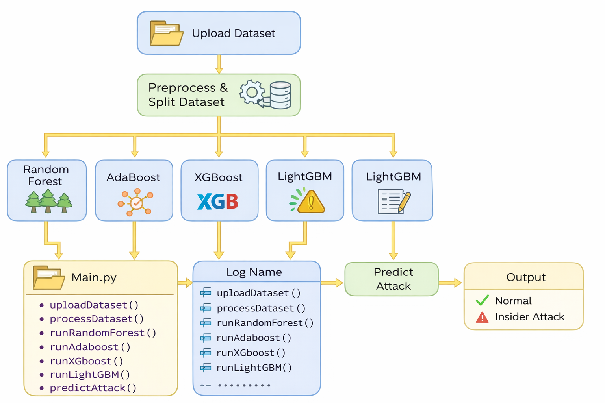
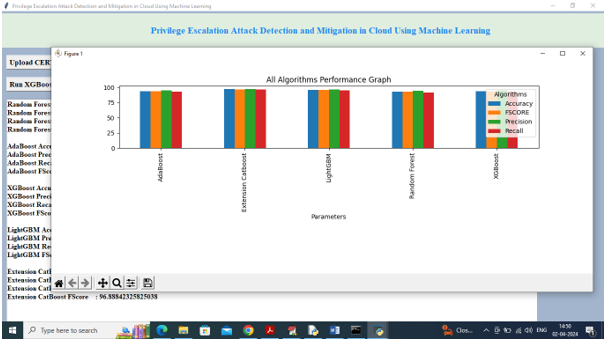
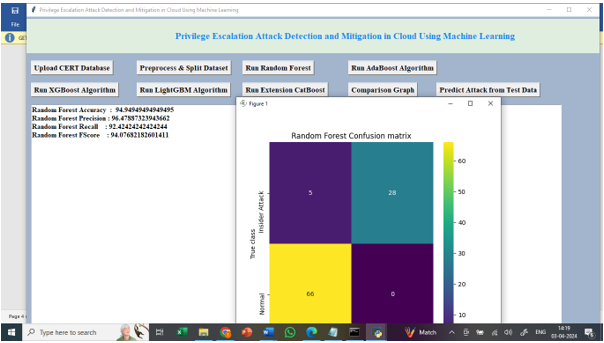
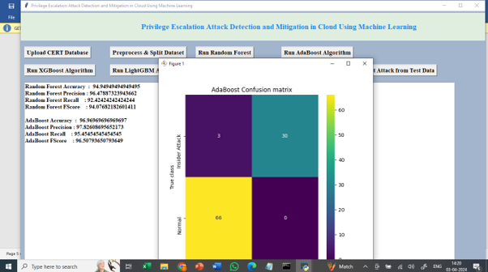
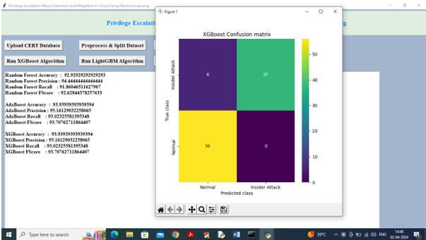
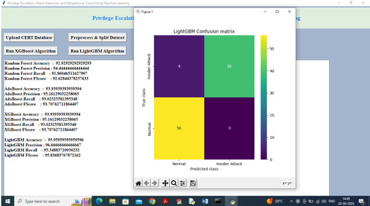
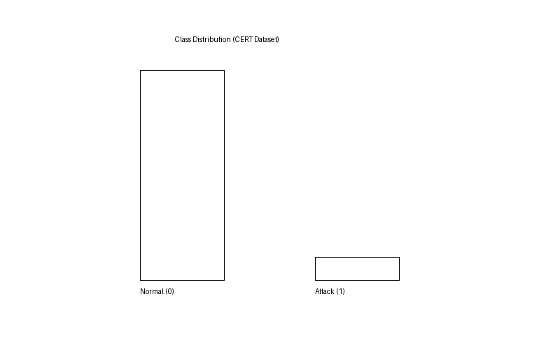

# 🔐 Privilege Escalation Attack Detection and Mitigation in Cloud using Machine Learning

**Major Project - Bachelor of Engineering in Computer Science and Engineering**
Lords Institute of Engineering and Technology (UGC Autonomous), Hyderabad
Academic Year 2025-2026

---

## 👥 Team Members

| Name                      | Roll Number  |
| ------------------------- | ------------ |
| Mohammed Abdullah Hussain | 160922748104 |
| Mohammed Abdul Razzak     | 160922748103 |
| Mir Ahmed Ali             | 160922748095 |
| Mohammed Ghouse           | 160922748113 |

---

## 📌 Project Overview

This project presents a **machine learning-based cloud security system** designed to detect and mitigate **privilege escalation attacks**.

The system analyzes user behavior and system activity patterns to identify abnormal actions that may indicate unauthorized privilege access.

---

## 🎯 Objectives

* Detect privilege escalation attacks using ML algorithms
* Analyze abnormal behavioral patterns
* Compare multiple ML models for best performance
* Provide mitigation insights based on predictions

---

## ⚙️ Methodology

### Data Pipeline

* Upload dataset
* Preprocess & split data
* Feature extraction

### Modeling

* Random Forest
* AdaBoost
* XGBoost
* LightGBM
* CatBoost (Extension)

### Prediction

* Classifies activity as:

  * ✅ Normal
  * ⚠️ Insider Attack

---

## 🧠 System Architecture



This diagram shows the full pipeline from dataset upload to attack prediction using multiple ML models.

---

## 📊 Dataset

* CERT Insider Threat Dataset
* Training: `Dataset/CERT.csv`
* Testing: `Dataset/testData.csv`

---

## 📈 Results

### 🔹 Overall Model Performance



This graph compares Accuracy, Precision, Recall, and F1 Score across all models.

---

### 🔹 Random Forest Confusion Matrix



---

### 🔹 AdaBoost Confusion Matrix



---

### 🔹 XGBoost Confusion Matrix



---

### 🔹 LightGBM Confusion Matrix



---

### 🔹 Class Distribution



---

## 📊 Key Insights

* Ensemble models performed highly accurate detection
* LightGBM and XGBoost showed strong performance
* System effectively distinguishes between normal and attack behavior

---

## 🖥️ GUI Application

The system includes a GUI with features:

* Upload dataset
* Preprocess data
* Run ML models
* Compare results
* Predict attacks

---

## 🛠️ Tech Stack

| Layer         | Technology                      |
| ------------- | ------------------------------- |
| Language      | Python                          |
| ML            | Scikit-learn, XGBoost, LightGBM |
| Data          | Pandas, NumPy                   |
| Visualization | Matplotlib                      |
| GUI           | Tkinter                         |

---

## 📂 Repository Structure

```
.
├── Main.py
├── test.py
├── Dataset/
│   ├── CERT.csv
│   └── testData.csv
├── docs/
│   ├── architecture.png
│   ├── performance.png
│   ├── rf_confusion.png
│   ├── adaboost_confusion.png
│   ├── xgboost_confusion.png
│   ├── lightgbm_confusion.png
│   └── class_distribution.png
├── requirements.txt
└── README.md
```

---

## ⚡ Quick Start

### Install Dependencies

```
pip install -r requirements.txt
```

---

## ▶️ Execution

### Run Application

```
python Main.py
```

### Run Testing

```
python test.py
```

---

## 📊 Output

* Confusion matrices
* Performance graphs
* Attack predictions

---

## 🌍 Why This Project Matters

* Solves real-world cloud security problems
* Demonstrates ML application in cybersecurity
* Helps detect insider threats effectively

---

## 📜 License

This project is submitted as part of academic coursework at LIET.

